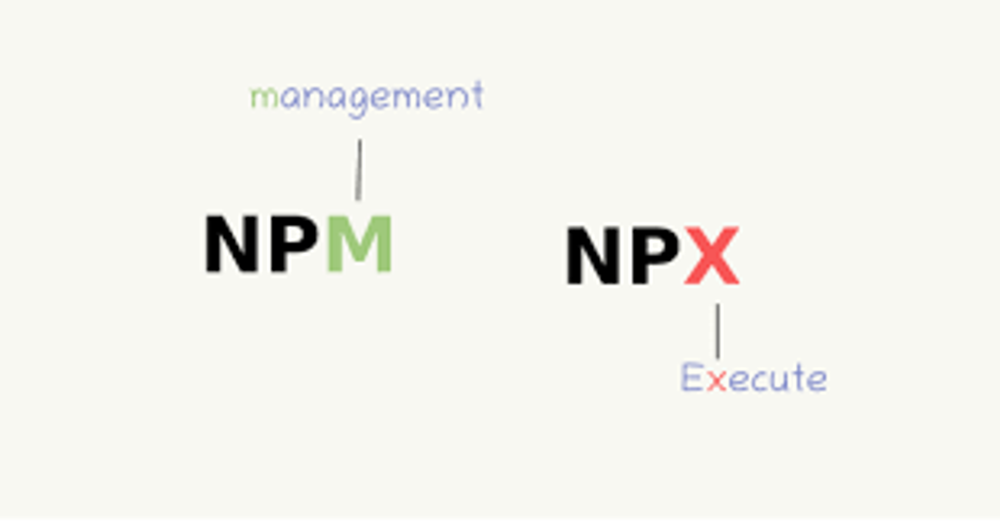

# 개발 환경

```text
키워드

- Node.js
- NPM(Node Package Manager)
    - package.json / package-lock.json
    - node_modules
    - npx
- ES Modules vs CommonJS
```

## Node.js

Chrome V8 JavaScript 엔진으로 빌드된 JavaScript 런타임

LTS(Long Term Support) : 안정적인 버전

### npm 프로젝트 생성

``` bash
  mkdir folderName
  cd folderName 
  npm init -y
```

### npm, npx


npm(Node Package Manager) : node.js를 위한 패키지 매니저, node.js를 위한 오픈 소스 생태계

npx(Node Package Execute) : 모듈을 로컬에 저장하지 않고, 매번 최신 버전의 파일만을 임시로 불러와 실행 시킨 후에, 다시 그 파일은 없어짐

---

### package.json

개발자가 배포한 패키지에 대해, 다른 사람들이 관리하고 설치하기 쉽게 하기 위한 문서

상세내용 : <https://outofbedlam.gitbooks.io/npm-handbook/content/config/package-json.html>

### package-lock.json

npm패키지 매니저에서 node_modules 디렉토리에 설치된 패키지들의 의존성 트리를 기록하는 파일

npm을 사용해서 node_modules 트리나 package.json을 수정시 자동으로 생성되며, 생성 시점의 의존성 트리에 대한 정보를 가지고 있음. 따라서, pacakge.json의 버전 범위에 따라 버전이 바뀌더라도, package-lock.json 파일이 작성된 시점의 의존성 트리가 다시 생성될 수 있게 보장됨.

---

### node_modules

package.json에 있는 모듈과, 그 모듈들이 의존하고 있는 모든 모듈들을 포함하고 있음.

npm에 새로운 모듈이 추가될 때, 자동으로 package.json과 node_modules에 추가되게 됨.

node_modules를 git에 commit하지 않아도, pacakge.json에 설치한 패키지의 정보가 모여있기 때문에, npm i 명령어로 node_modules를 언제든지 추가함.

---

## ES Modules(ESM)

- ES6에 도입된 모듈 시스템
- import, export를 사용해 분리된 자바스크립트 파일끼리 서로 접근할 수 있음.

## CommonJs(CJS)

- nodeJs에서 사용하는 표준 모듈 명세
- require, module.exports를 사용

---

## TypeScript 세팅

```bash
npm i -D typescript
npx tsc --init
```

> npx(node pack) : 모듈을 로컬에 저장하지 않고, 매번 최신 버전의 파일만을 임시로 불러와 실행 시킨 후에, 다시 그 파일은 없어지는 방식

```json
  //tsconfig.json

  // ...(전략)...
  "jsx": "react-jsx", /* Specify what JSX code is generated. */
  ...
  "types": ["node", "jest", "@testing-library/jest-dom"],                                      /* Specify type package names to be included without being referenced in a source file. */
  // ...(후략)...
```

주석되어있던 jsx 라인을 주석을 해제

```json
  //package.json
  {
    "scripts" : {
      "check" : "tsc --noEmit"
    }
  }
```

TypeScript 컴파일을 통해 문법오류를 확인할수 있는 check 명령을 package.json에 추가

## ESLint 세팅

ESLint는 코딩 컨벤션에 위배되는 코드나 안티 패턴을 자동 검출하는 도구

```bash
npm i -D eslint
npx eslint --init

? How would you like to use ESLint? …
❯ To check syntax, find problems, and enforce code style

? What type of modules does your project use? …
❯ JavaScript modules (import/export)

? Which framework does your project use? …
❯ React

? Does your project use TypeScript?
› Yes

? Where does your code run? …
✔ Browser

? How would you like to define a style for your project? …
❯ Use a popular style guide

? Which style guide do you want to follow? …
❯ XO: https://github.com/xojs/eslint-config-xo-typescript

? What format do you want your config file to be in? …
❯ JavaScript

? Would you like to install them now with npm?
› Yes

? Which package manager do you want to use?
> npm
```

이전에는 Airbnb가 있었으나, 지금은 없어져서, xo로 셋팅

```javascript
// .eslintrc.js

module.exports = {
  // ...(전략)...
  extends: [
    'xo',
    'plugin:react/recommended',
    'plugin:react/jsx-runtime',
  ],
  // ...(중략)...
  settings: {
    'import/resolver': {
      node: {
        extensions: ['.js', '.jsx', '.ts', '.tsx'],
      },
    },
  },
  rules: {
    indent: ['error', 2],
    'no-trailing-spaces': 'error',
    curly: 'error',
    'brace-style': 'error',
    'no-multi-spaces': 'error',
    'space-infix-ops': 'error',
    'space-unary-ops': 'error',
    'no-whitespace-before-property': 'error',
    'func-call-spacing': 'error',
    'space-before-blocks': 'error',
    'keyword-spacing': ['error', { before: true, after: true }],
    'comma-spacing': ['error', { before: false, after: true }],
    'comma-style': ['error', 'last'],
    'comma-dangle': ['error', 'always-multiline'],
    'space-in-parens': ['error', 'never'],
    'block-spacing': 'error',
    'array-bracket-spacing': ['error', 'never'],
    'object-curly-spacing': ['error', 'always'],
    'key-spacing': ['error', { mode: 'strict' }],
    'arrow-spacing': ['error', { before: true, after: true }],
    'import/no-extraneous-dependencies': ['error', {
      devDependencies: [
        '**/*.test.js',
        '**/*.test.jsx',
        '**/*.test.ts',
        '**/*.test.tsx',
      ],
    }],
    'import/extensions': ['error', 'ignorePackages', {
      js: 'never',
      jsx: 'never',
      ts: 'never',
      tsx: 'never',
    }],
    'react/jsx-filename-extension': [2, {
      extensions: ['.js', '.jsx', '.ts', '.tsx'],
    }],
  },
};
```

### eslintignore 세팅

```bash
/node_modules/
/dist/
```

## React 설치

```bash
npm i react react-dom
npm i -D @types/react @types/react-dom
```

리액트 설치 후, 리액트 기본 코드를 작성한다.

```bash
mkdir src
touch src/index.tsx
touch src/App.tsx
```

```tsx
// src/App.tsx
export default functionm App() {
  return (
    <p>Hello, world!</p>
  )
}
```

```tsx
// src/index.tsx
import ReactDOM from 'react-dom/client';
import App from './App';

const element = document.getElementById('root');

if (element) {
 const root = ReactDOM.createRoot(element);
 root.render(<App/>);
}
```

## Jest(테스팅 도구) 설치

```bash
npm i -D jest @types/jest @swc/core @swc/jest jest-environment-jsdom  @testing-library/react @testing-library/jest-dom
```

```javascript
//jest.config.js
module.exports = {
  preset: 'ts-jest',
  testEnvironment: 'jsdom',
  setupFilesAfterEnv: [
    '@testing-library/jest-dom',
    './jest.setup.js',
  ],
  transform: {
  '^.+\\.(t|j)sx?$': ['@swc/jest', {
   jsc: {
    parser: {
     syntax: 'typescript',
     jsx: true,
    },
    transform: {
     react: {
      runtime: 'automatic',
     },
    },
   },
  }],
 },
  moduleNameMapper: {
  '^src/(.*)$': '<rootDir>/src/$1',
 },
  testPathIgnorePatterns: [
    '<rootDir>/node_modules/',
    '<rootDir>/dist/',
  ],
};


// jest.setup.js
''
```

```javascript
//.eslintrc.js
module.exports = {
  env: {
    // ...(전략)...
    jest: true,
  },
  // ...(후략)...
};
```

```json
//package.json
{
  "scripts": {
    // ...(전략)...
    "test": "jest"
  }
}
```

```bash
npm test
```

npm test를 통해 jest 실행

## Parcel 설치

모듈 번들러 : 자바스크립트 파일들을 최적화, 압축하여 하나 혹은 여러개의 static 파일로 빌드해 주는 컴파일러

```bash
npm i -D parcel
```

```json
//package.json
{
  "scripts" : {
    "start" :  "parcel index.html --port 8080",
    // ...(후략)...
  }
}
```

```html
<!-- index.html -->

<!DOCTYPE html>
<html lang="ko">
<head>
  <meta charset="UTF-8">
  <title>Sample</title>
</head>
<body>
  <div id="app">
    Loading...
  </div>
  <script type="module" src="./src/index.tsx"></script>
</body>
</html>
```

```bash
npm start
```

npm start를 이용하여 React Project 실행

## GitIgnore 세팅

```bash
/node_modules/
/dist/
/.parcel-cache/
```

### 쉽게 gitignore 생성하는 방법

1. toptal gitignore 생성기 사용  
<https://www.toptal.com/developers/gitignore>

2. github gitignore repository 사용  
<https://github.com/github/gitignore>
<https://github.com/github/gitignore/blob/main/Node.gitignore>

## VsCode Setting

jest, trailing Extension 설치

```json
// setting.json
{
    "editor.rulers": [
        80
    ],
    "editor.codeActionsOnSave": {
        "source.fixAll.eslint": true
    },
    "trailing-spaces.trimOnSave": true
}
```
