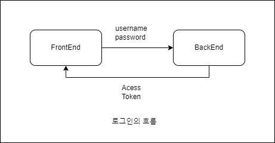

# 로그인 & 로그아웃

- [온라인 쇼핑몰 REST API](https://docs.google.com/document/d/1bGYl3IDoX53cNBbZHNlsRhPLZQ3Qiu-Jm3gpqyu_xI0/view)




- FrontEnd  : 사용자의 정보를 백엔드에 전송
- BackEnd : Access Token을 회신

> 수신받은 Access Token을 전역적으로 동기화 하여 사용한다.

## Access Token

클라이언트에서 인증 정보를 보관하는 방법

세션 기반 인증의 경우, 클라이언트에서 유저 정보를 요청 할 때마다 정보의 회신 여부를 확인해야 했고, 매 요청마다 DB를 조회해야 하는 점 때문에, 토큰 기반 인증 개념이 생겨났다.

클라이언트는 보안에 취약할 수 있지만, 토큰은 유저정보를 아뫃화 한 상태로 담을 수 있고, 암호화를 진행하였기 때문에 클라이언트에 담을 수 있다.

### JWT Token

`JWT Token`은 `Json Web Token`의 약자로, 웹에서 쓰이는 json 토큰이다.

`Access Token`과 `Refresh Token`으로 구성되어 있다.

- Access Token의 유효기간은 짧다. (ex. 60일(마이크로소프트), 1시간(아마존))
- Refresh Token의 유효기간은 길다. (ex. 1년 (마이크로소프트))

평소에 API 통신할 때는 Access Token을 사용하고, Refresh Token은 Access Token이 만료되어 갱신될 때만 사용한다.

### JWT Token Process

1. 로그인 인증에 성공한 클라이언트는 Refresh Token과 Access Token 두 개를 서버로부터 받는다.
2. 클라이언트는 Refresh Token과 Access Token을 로컬에 저장해놓는다.
3. 클라이언트는 헤더에 Access Token을 넣고 API 통신을 한다. (Authorization)
일정 기간이 지나 Access Token의 유효기간이 만료되었다.
4. 권한 체크
  4-1. Access Token은 이제 유효하지 않으므로 권한이 없는 사용자가 된다.
  4-2. 클라이언트로부터 유효기간이 지난 Access Token을 받은 서버는 401 (Unauthorized) 에러 코드로 응답한다.
  4-3. 401를 통해 클라이언트는 invalid_token (유효기간이 만료되었음)을 알 수 있다.
5. 헤더에 Access Token 대신 Refresh Token을 넣어 API를 재요청한다.
6. Refresh Token으로 사용자의 권한을 확인한 서버는 응답쿼리 헤더에 새로운 Access Token을 넣어 응답한다.
7. 만약 Refresh Token도 만료되었다면 서버는 동일하게 401 error code를 보내고, 클라이언트는 재로그인해야한다.

---

## AccessToken 후속 처리

전역적으로 선언된 Access Token을 조회하여, 분기를 나눠준다.

```tsx
{accessToken ? (
  <>
    <li>
      <Link to="/cart">Cart</Link>
    </li>
    <li>
      <Button onClick={handleClickLogout}>
        Logout
      </Button>
    </li>
  </>
) : (
  <li>
    <Link to="/login">Login</Link>
  </li>
)}
```

---

## API 호출할 때, accessToken을 사용

```typescript
export default class ApiService {
  private instance = axios.create({
    baseURL : API_BASE_URL,
    headers : {Authorization : 'Bearer TOKEN'}
  })
}

```

### Bearer이란?

토큰은 요청 헤더의 Authorization필드에 다음과 같이 담겨 보내진다.

> Authorization : <type><credentials>

bearer는 위 형식에서 type에 해당한다.


#### 다양한 타입들

- Basic : 사용자 아이디와 암호를 Base64로 인코딩한 값을 토큰으로 사용한다. (RFC 7617)

 
- Bearer : JWT 혹은 OAuth에 대한 토큰을 사용한다. (RFC 6750)
 
- Digest : 서버에서 난수 데이터 문자열을 클라이언트에 보낸다. 클라이언트는 사용자 정보와 nonce를 포함하는 해시값을 사용하여 응답한다 (RFC 7616)
 
- HOBA : 전자 서명 기반 인증 (RFC 7486)
 
- Mutual : 암호를 이용한 클라이언트-서버 상호 인증 (draft-ietf-httpauth-mutual)
 
- AWS4-HMAC-SHA256 : AWS 전자 서명 기반 인증 (링크)

출처 : [ Plus Ultra:티스토리](https://overcome-the-limits.tistory.com/741) 

---

### AccessToken 확인

AccessToken의 만료 · 위변조 여부를 파악하여, 확인하기 위해 회원정보를 확인한다.

회원정보 조회가 실패하면 AccessToken에 문제가 있으므로, 로그아웃을 시킨다.

---

## 로그아웃

로그아웃 시, 로그아웃 API를 호출하고 저장된 AccessToken을 초기화하고 메인 화면으로 이동하면 된다.

> 로그아웃 API를 호출하였을때, 기존 토큰으로 서버에 요청을 하더라도, 서버에서 인증된 토큰으로 보지 않는다.

---

# 회원가입 & 주문목록 & 주문 상세

## 회원가입

회원가입의 경우, 회원이 입력한 값들을 검증하고 그 값들을 API에 전송하여, 회원가입을 진행한다.

회원가입을 진행한 이후에는 API로부터 응답받은 `accessToken`을 설정하여 자동으로 로그인이 되도록 할 수 있다.

---

## 주문목록 & 주문상세

- 상품목록은 모두가 같은 것을 보는 것

- 주문목록은 개인적인 내용을 보는 것

> 로그인 상태에 따라, 화면이 다른게 나타나도록 처리하는 부분이 필요하다.
