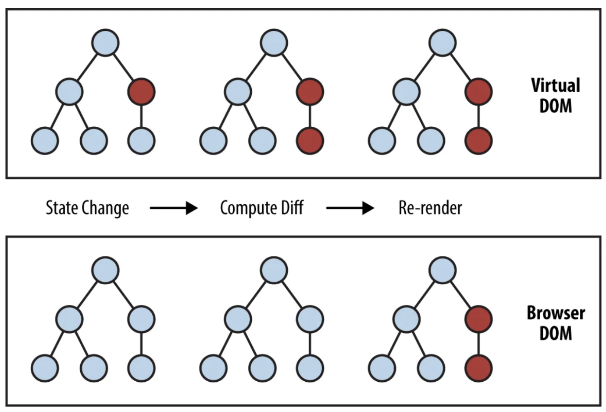
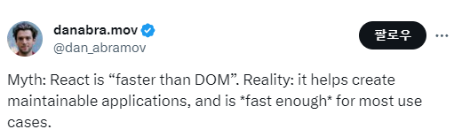
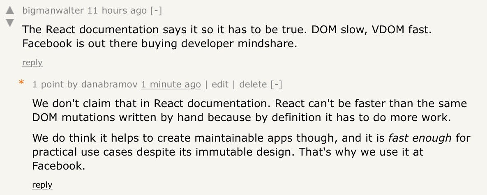
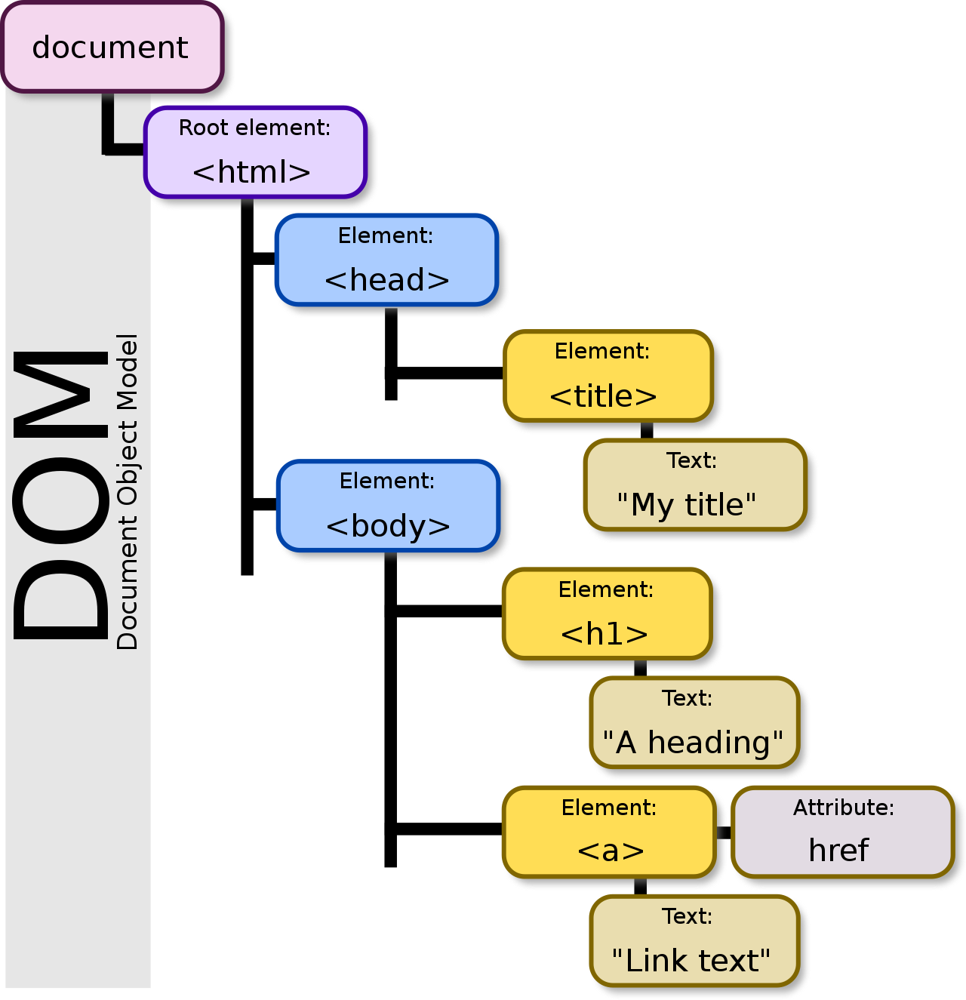
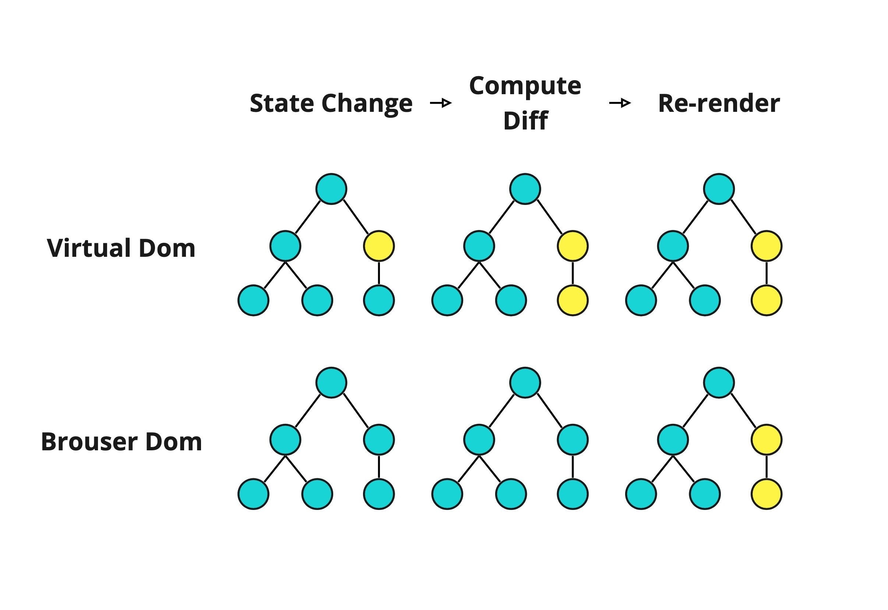

# JSX

```text
키워드

- React에서 JSX를 사용하는 목적
- Syntactic sugar
- React.createElement
- React Element
- React StrictMode
- VDOM(Virtual DOM)이란?
    - DOM이란?
    - DOM과 Virtual DOM의 차이
- Reconciliation(재조정) 과정은 무엇인가?
```

> "XML-like syntax extension to ECMAScript"

JSX는 리액트 부산물 같은 것이다. 그리고, JSX를 꼭 리액트에서만 사용하는 것도 아니다.

JSX는 XML처럼 작성된 부분을 React.createElement을 쓰는 JavaScript 코드로 변환한다.
중괄호를 써서 JavaScript 코드를 그대로 쓸 수 있고, 결국은 JavaScript 코드와 1:1로 매칭된다.

---

- [Facebook의 JSX 소개](https://facebook.github.io/jsx/)
- [React 공식문서의 JSX 소개](https://ko.reactjs.org/docs/introducing-jsx.html)
- [Babel, JSX, 그리고 빌드 과정들](https://ko.reactjs.org/docs/faq-build.html)
- [JSX 이해하기](https://ko.reactjs.org/docs/jsx-in-depth.html)

JSX를 ECMAScript 사양 자체에 통합하자는 제안은 아니다.
__JSX는 React.createElement(component, props, ...children) 함수에 대한 문법적 설탕일 뿐이다.__

```javascript
// JSX를 이용하여 UI 컴포넌트를 표현
var dropdown = 
 <Dropdown>
  A dropdown list
  <Menu>
   <MenuItem>Do Something</MenuItem>
  </Menu>
 </Dropdown>

render(dropdown);
```

속성이 있는 트리 구조를 정의핟기 위해 간결하고 친숙4한 구문을 정의했다.
XML 또는 HTML 사양을 준수하려고 시도하지 않는다.
JSX는 ECMAScript 기능을 설계되었으며 XML과의 유사성은 단지 친숙함을 위한 것이다.

JSX는 XML처럼 작성된 부분을 React.createElement로 코드를 변환하고,
중괄호를 써서 JavaScript코드를 그대로 쓸 수 있으며, JavaScript 코드와 1:1로 매칭된다.

React는 JSX 사용이 필수가 아니지만, 대부분의 사람은 __JavaScript 코드 안에서 UI 관련 작업을 할 때 시각적으로 더 도움이 된다고 생각__ 합니다.
또한 React가 더욱 도움이 되는 에러 및 경고 메시지를 표시할 수 있게 해줍니다.

## [Babel](https://babeljs.io)

[Babel Repo](https://babeljs.io/repl)

Presets”에서 “react”를 체크하거나, “Plugins”에서 “@babel/plugin-transform-react-jsx”를 추가하면 JSX를 실험할 수 있다

```jsx
// JSX 파일
<p>Hello, world!</p>
```

```javascript
// Babel
React.createElement('p', null, 'Hello world!')
```

> JSX 파일에 "@jsx 어쩌고" 주석을 추가하면 React.createElement 대신 "어쩌고"를 쓰게 된다.

```jsx
<Button 
 type="submit" 
 onClick={() => console.log('Clicked')}
>Send</Button>
```

```javascript
React.createElement('button', {
  type : 'submit',
  onClick : () => console.log('Clicked')
 },
 'Send'
)
```

```jsx
<div className="test">
 <p>Hello world!</p>
 <Button type="submit">Send</Button>
</div>
```

```javascript
 React.createElement(
  'div'
  {className: 'test'},
  React.createElement('p', null, 'Hello world!'),
  React.createElement(Button, {type : 'submit'}, "Send"),
 )
```

- [JSX 없이 사용하는 React](https://ko.reactjs.org/docs/react-without-jsx.html)
- [createElement](https://beta.reactjs.org/reference/react/createElement)

JSX Runtime은 _jsx란 함수를, Preact는 h란 함수를 직접 지원한다.

### _jsx

- [_jsx](https://reactjs.org/blog/2020/09/22/introducing-the-new-jsx-transform.html)

```javascript
function App() {
  return <h1>Hello World</h1>;
}
```

```javascript
// JSX Transform compiler
// Inserted by a compiler(dont't import it yourself!)
// 해당 코드는 컴파일러가 하므로, 직접 import하지 말 것!

import {jsx as _jsx} from 'react/jsx-runtime';

function App() {
  return _jsx('h1', { children: 'Hello world' });
}
```

### _h

- [h()](https://preactjs.com/guide/v10/api-reference/#h--createelement)

```jsx
<div id="foo">Hello!</div>
```

```javascript
import { h } from 'preact';

h('div', { id: 'foo' }, 'Hello!');
```

## Reconciliation(재조정) 과정

리액트는 컴포넌트에서 prop이나 state가 변경될 때, 직전에 렌더링된 요소(element)와 새로 반환된 요소를 비교하여 실제 DOM을 업데이트 할지 말지 결정해야 한다.
이때 두 element가 일치하지 않으면 리액트는 새로운 요소로 DOM을 업데이트 하는데, 이러한 프로세스를 Reconciliation라고 한다.



### 비교 알고리즘(Diffing Algorithm)

두 개의 트리를 비교할 때, React는 두 엘리먼트의 루트(root) 엘리먼트부터 비교한다.
이후의 동작은 루트 엘리먼트의 타입에 따라 달라진다.

- 엘리먼트의 타입이 다른 경우 :  이전 트리를 버리고 완전히 새로운 트리를 구축한다.

```jsx
    // 이전 트리
    <div>
      <Counter />
    </div>

    // 새로운 트리
    <span>
      <Counter />
    </span>

    // 이전 Counter는 버리고 새로운 Counter 사용
```

- DOM 엘리먼트의 타입이 같은 경우: 두 엘리먼트의 속성을 확인하여, 동일한 내역은 유지하고 변경된 속성들만 갱신한다.

```jsx
    <div className="before" title="stuff" />

    <div className="after" title="stuff" />
    // className만 수정
```

- DOM 노드의 처리가 끝나면, React는 이어서 해당 노드의 자식들을 재귀적으로 처리한다.

### 자식에 대한 재귀적 처리

DOM 노드의 자식들을 재귀적으로 처리할 때, React는 기본적으로 동시에 두 리스트를 순회하고 차이점이 있으면 변경된 부분을 갱신한다.

key가 없을 경우, 성능저하를 야기할 수 있다.

자식들이 key를 가지고 있다면, React는 key를 통해 기존 트리와 이후 트리의 자식들이 일치하는지 확인한다.

인덱스를 키로서 사용할 경우, 재정렬을 통해 컴포넌트 state에 문제가 발생할 수 있다.

#### React의 성능이 저하하는 경우

1. 다른 컴포넌트 타입의 서브트리를 일치시키려고 하지 않습니다. 아주 유사한 출력을 가진 두 컴포넌트 타입을 번갈아 사용하는 경우 같은 타입으로 만들 수 있습니다.

2. 키는 안정적이고 예측가능하며 고유해야 한다. Math.random()을 이용해 생성된 키와 같은 불안정한 키는 많은 컴포넌트 인스턴스와 DOM 노드가 불필요하게 다시 작성되어 하위 컴포넌트의 성능 저하 및 state 손실을 초래할 수 있다.

## React Developer Tools

- [react devtools extensions](https://github.com/facebook/react/tree/main/packages/react-devtools-extensions)

### [React Strict Mode](https://ko.reactjs.org/docs/strict-mode.html)

``` jsx
<React.StrictMode>
 <App>
</React.StrictMode>
```

리액트가 자식 컴포넌트를 검사하고 잘못 사용된 부분을 알림.

### 검사항목

- 잘못 사용한 생명주기 메서드: componentWillMount 같은 지원 종료(deprecated)한 메서드를 사용하면 경고.

- 레거시 문자열 ref 사용 여부

- findDOMNode 사용 여부: 컴포넌트 자식 중 특정 엘리먼트를 찾는 함수. 자식 엘리먼트는 구현 방식에 따라 달라질 수 있기 때문에 유지보수하기 어려워 사용을 자제해야 함. 직접 ref를 지정해 사용하라고 권장.

- 예상치 못한 부작용(side effect): 리액트는 컴포넌트를 렌더링하기 위해 두 단계를 거침. 렌더링과 커밋을 거치는데, 렌더링 단계에서는 변화를 계산하는 단계이다. 예를 들어 render 함수를 호출해서 이전값과 비교하는 방식이다. 이렇게 계산한 변경을 반영하는 단계가 커밋이다.

  - 렌더링 단계의 메서드에 부작용이 있는지를 검사. 리액트가 경고한다면, 부작용 코드를 커밋 단계로 옮기는 것이 좋음.

  > Strict Mode에서는 부작용을 진단할 목적으로, 렌더링 단계의 메서드를 두번씩 호출함.

- 레거시 컨텍스트 사용 여부

## VDOM을 쓰는 이유

> 미신 : VDOM을 쓰는건 빠르다.




- 미신 : 리액트가 DOM보다 빠르다는 것은 미신입니다.
- 현실 : 유지 관리 가능한 애플리케이션을 만드는 데 도움이 되며 대부분의 사용 사례에 충분히 빠릅니다.

## VDOM(Virtual DOM)

- [VDOM (Virtual DOM)](https://ko.reactjs.org/docs/faq-internals.html)
- [재조정 (Reconciliation)](https://ko.reactjs.org/docs/reconciliation.html)

Virtual DOM (VDOM)은 UI의 이상적인 또는 “가상”적인 표현을 메모리에 저장하고 ReactDOM과 같은 라이브러리에 의해 “실제” DOM과 동기화하는 프로그래밍 개념이다.

React는 컴포넌트 트리에 대한 추가 정보를 포함하기 위해 “fibers”라는 내부 객체를 사용합니다. 또한 React에서 “virtual DOM” 구현의 일부로 간주할 수 있습니다.

[React Fiber Architecture](https://github.com/acdlite/react-fiber-architecture)

트리는 프랙탈과 같다.
트리의 구성요소는 트리다. 우리는 매번 작은 React Element 트리, VDOM 트리를 만든다.
VDOM은 실제 DOM과 비교를 통해 변경사항을 적용한다.

그리고 이러한 접근방식이 React의 선언적 API를 가능하게 한다.

VDOM이 무엇이고, 왜 쓰는지 안다면 활용할 수 있는 [최적화 기법](https://ko.legacy.reactjs.org/docs/optimizing-performance.html)이 존재함.

## DOM vs Virtual DOM

### DOM

DOM(Document Object Model)은 HTML(Hyper Text Markup Language)로 조작할 수 있는 모델을 말한다.



위와같이, HTML로 구성된 트리 구조를 가진 객체이다.
DOM은 트리 구조로 되어 있어, 이해하기 쉽고 탐색하기 좋다는 장점이 있다.

하지만 웹이 크고 복잡해짐에 따라, DOM이 거대해졌고 변경하고자 하는 노드를 탐색하려면 시간이 많이 걸리고, 노드에 변경점이 생겼을 때 DOM 트리를 다시 렌더링하는 비효율적 프로세스가 발생하게 되었다.

### Virtual DOM



가상 돔(Virtual DOM)은 실제 DOM을 추상화한 개념으로 , 변화가 실제 DOM에 적용되기 전에 가상의 DOM을 한번 거쳐 미리 처리하고 저장한 후 실제 DOM에 업데이트 할 수 있게 해준다.

Virtual DOM은 DOM이 생성되기 전에 이전의 값과 비교하여 달라진 부분만 감지하여 수정 한, 실제 DOM에 반영한다. 따라서 DOM은 Virtual DOM으로부터 전달받은 최종 결과물을 한번만 렌더링 하면 된다.

이에따라, DOM에서 렌더링이 일어나는 단계를 줄임으로서 효율적인 DOM조작이 가능하게 만들었다. 따라서 지속적으로 데이터가 변화하는 대규모 어플리케이션을 구축하는 데에 유용하다.

## 문법적 설탕

Syntactic sugar, or syntax sugar, is a visually or logically-appealing “shortcut” provided by the language, which reduces the amount of code that must be written in some common situation.

- 프로그래밍 언어 차원에서 제공되는 논리적으로 간결하게 표현하는 것
- 중복되는 로직을 간결하게 표현하기 위해 나타나게 되었다.

---

## 결론

Virtual DOM을 어떻게 다루는지 이해가 있다면, 컴포넌트를 분할하는 방법만 바꿔도 퍼포먼스가 좋아진다

---

Dan Abramov

- [Redux](https://redux.js.org/) 창시자
- [React Core 개발자](https://beta.reactjs.org/learn/meet-the-team)
