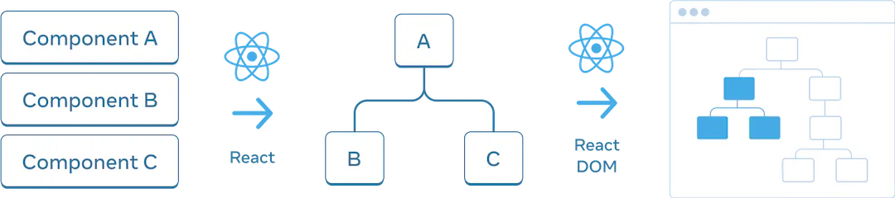
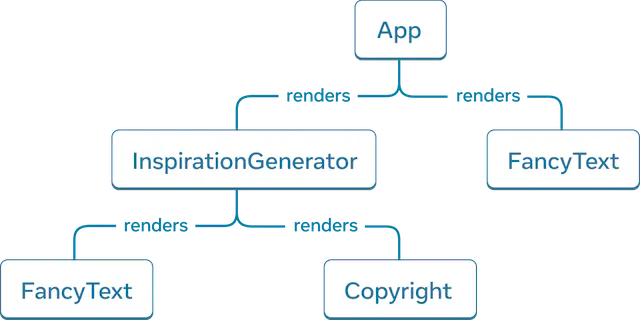
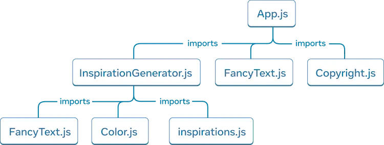

# UI Tree

React는 트리 구조를 사용하여 React앱의 구성요소 간의 관계를 관리하고 모델링을 합니다. React 앱을 통해 데이터가 흐르는 방식과 렌더링 및 앱 크기를 최적화하는 방법을 이해하는 데 유용한 도구입니다.

## Render Tree

렌더링 트리는 React 애플리케이션의 단일 렌더링 패스를 나타냅니다.

조건부 렌더링을 사용하면 부모 구성 요소가 전달된 데이터에 따라, 다른 자식을 렌더링 할 수 있습니다.

## 모듈 종속성 트리

React 앱의 또 다른 관계는 앱의 모듈 종속성입니다.

별도의 파일로 분할할 때 Component, 함수 또는 상수를 내보낼 수 있는 Js Module을 만듭니다.

---

트리는 엔터티 간의 관계를 나타내는 일반적인 방법입니다. UI를 모델링하는 데 자주 사용됩니다.

렌더 트리는 단일 렌더링에서 React 구성 요소 간의 중첩 관계를 나타냅니다.

조건부 렌더링을 사용하면 렌더링 트리가 다른 렌더링에서 변경될 수 있습니다. prop 값이 다르면 구성 요소가 다른 자식 구성 요소를 렌더링할 수 있습니다.

렌더 트리는 최상위 수준과 리프 구성 요소가 무엇인지 식별하는 데 도움이 됩니다.

최상위 구성 요소는 그 아래에 있는 모든 구성 요소의 렌더링 성능에 영향을 미치며 리프 구성 요소는 종종 자주 다시 렌더링됩니다. 이를 식별하면 렌더링 성능을 이해하고 디버깅하는 데 유용합니다.

종속성 트리는 React 앱의 모듈 종속성을 나타냅니다.

종속성 트리는 빌드 도구에서 앱을 제공하는 데 필요한 코드를 번들로 묶는 데 사용됩니다.

종속성 트리는 페인팅 시간을 늦추고 번들로 제공되는 코드를 최적화할 수 있는 기회를 노출하는 큰 번들 크기를 디버깅하는 데 유용합니다.
