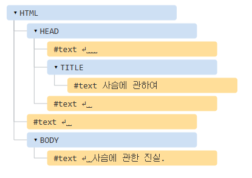

# DOM 트리

DOM(Document Object Model)에 따르면, HTML태그는 객체입니다.

태그 하나가 감싸고 있는 '자식'태그는 중첩 태그(nested tag)라고 부릅니다.

태그 내의 문자 역시, 객체입니다.

```javascript
document.body
```

DOM은 HTML을 아래와 같이 태그 트리 구조로 표현합니다.



위의 태그 트리에 있는 노드는 모두 객체입니다.

태그는 요소 노드(element node)이고, 트리구조를 구성합니다.
요소내의 문자는 텍스트 노드(text node)가 됩니다.

## 텍스트 노드의 예외

```text
역사적인 이유로, <head> 이전의 공백과 새 줄은 무시됩니다.

HTML 명세서에서 모든 콘텐츠는 body 안쪽에 있어야 한다고 했으므로, </body> 뒤에 무언가를 넣더라도 그 콘텐츠는 자동으로 body 안쪽으로 옮겨집니다. 따라서 </body> 뒤엔 공백이 있을 수 없습니다.
```

## 자동 교정

기형적인 HTML을 만나면, 브라우저는 DOM 생성과정에서 HTML을 자동으로 교정합니다.

## 기타 노드 타입

주석도 노드가 됩니다.

노드타입은 총 열두가지인데, 실무에서는 주로 네 가지 노드를 다룹니다.

> DOM의 '진입점"이 되는 문서(document) 노드

> HTML 태그에서 만들어지며, DOM 트리를 구성하는 블록인 요소 노드(element node)

> 텍스트를 포함하는 텍스트 노드(text node)

> 화면에 보이지는 않지만, 정보를 기록하고 자바스크립트를 사용해 이 정보를 DOM으로부터 읽을 수 있는 주석(comment) 노드
