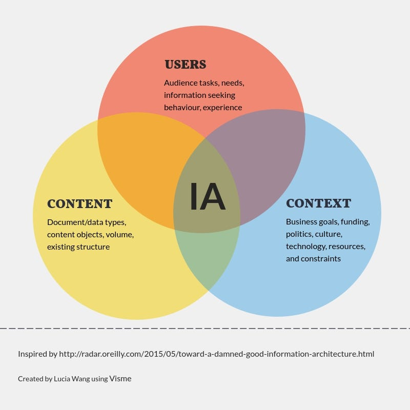

# React Component

``` text
키워드

- REST API 와 GraphQL
    - REST API 란 무엇인가
    - GraphQL은 왜 등장했는가?
    - REST API vs GraphQL
- JSON
- DSL(Domain-Specific Language)
- 선언형 프로그래밍
- 명령형 프로그래밍
- SRP(단일 책임 원칙)
- Atomic Design
- React component 와 props
```

## Thinking in React

> [Thinking in React](https://beta.reactjs.org/learn/thinking-in-react)

- "Step 1: UI를 컴포넌트의 계층구조로 나누기"
- "Step 2: 리액트로 정적인 버전으로 만들기"

**리액트는 선언형(HTML과 유사한 모양의 DSL을 사용)**

### DSL(Domain-Specific Language)

도메인 특화언어Domain-specific language(DSL)는 특정 기능이나 영역을 위해 만들어진 언어이고 아래와 같은 다양한 작업을 처리하기 위해 소프트웨어 개발에 많이 사용된다.

## React Component

복잡한 UI를 만드는데, 하나하나는 심플해야 한다.

> 컴포넌트가 너무 커지고 있다면, 문제가 있는 것이다.

### 기준

- SRP(Single Responsibility Principle) : 단일 책임 원칙
  - 모든 클래스(컴포넌트)는 하나의 책임만 가지며, 클래스(컴포넌트)는 그 책임을 완전히 캡슐화 해야 함.
- CSS 기준으로 생각해보기

 ```html
<div class="product">
   <div class="thumbnail"> <!-- 썸네일 컴포넌트-->
   </div>
   <div class="price"> <!-- 가격 컴포넌트 -->
   </div>
</div>
 ```

- Designers's Layer
- Infomation Architecture (JSON Schema의 영향) : 실제로 많이 씀.

#### Infomation Architecture(정보 구조도)



Information Architecture(IA)는 콘텐츠를 구조화 하는 것이다.

화면들의 연관성과 접근성을 업무별 필요한 기준으로 분류

#### [Atomic Design](./atomic-design.md)

**작은 컴포넌트 : 부품을 만들어서 조립. 조합을 잘 해 가짓수를 폭발적으로 늘릴 수 있음.**

---

## 선언형 프로그래밍 VS명령형 프로그래밍

### 선언형 프로그램

프로그램이 어떤 방법으로 해야 하는지를 나타내기보다 무엇과 같은지를 설명하는 경우에 "선언형"이라고 한다. 예를 들어, 웹 페이지는 선언형인데 웹페이지는 제목, 글꼴, 본문, 그림과 같이 "무엇"이 나타나야하는지를 묘사하는 것이지 "어떤 방법으로" 컴퓨터 화면에 페이지를 나타내야 하는지를 묘사하는 것이 아니기 때문이다. 이것은 전통적인 포트란과 C, 자바와 같은 명령형 프로그래밍 언어와는 다른 접근방식인데, 명령형 프로그래밍 언어는 프로그래머가 실행될 알고리즘을 명시해주어야 하는 것이다. 간단히 말하여, 명령형 프로그램은 알고리즘을 명시하고 목표는 명시하지 않는 데 반해 선언형 프로그램은 목표를 명시하고 알고리즘을 명시하지 않는 것이다.

또 다른 정의에 따르면, 프로그램이 함수형 프로그래밍 언어, 논리형 프로그래밍 언어, 혹은 제한형 프로그래밍 언어로 쓰인 경우에 "선언형"이라고 한다. 여기서 "선언형 언어"라는 것은 명령형 언어와 대비되는 이런 프로그래밍 언어들을 통칭하는 것이다.

> 선언형 프로그래밍은 "WHAT"를 제시한다.

```javascript
// 배열을 파라미터로 받으며, 각 요소에 1을 더해서 새로운 배열을 반환해주는 함수

function addOne (arr) {
    return arr.map((i) => i+1);
}
```

### 명령형 프로그래밍

컴퓨터 과학에서 명령형 프로그래밍(命令型 프로그래밍, 영어: imperative programming)은 선언형 프로그래밍과 반대되는 개념으로, 프로그래밍의 상태와 상태를 변경시키는 구문의 관점에서 연산을 설명하는 프로그래밍 패러다임의 일종이다. 자연 언어에서의 명령법이 어떤 동작을 할 것인지를 명령으로 표현하듯이, 명령형 프로그램은 컴퓨터가 수행할 명령들을 순서대로 써 놓은 것이다.
> 명령형 프로그래밍은 "HOW"를 제시한다.

```javascript
// 배열을 파라미터로 받으며, 각 요소에 1을 더해서 새로운 배열을 반환해주는 함수

function addOne (arr) {
    let results = [];
    for(let i = 0; i < arr.length; i += 1){
        results.push(arr[i]+1);
    }
    return results;
}
```

### Refactoring

#### Extract Function(함수 추출하기)

```javascript
// AS-IS
function printOwing(invoice) {
  printBanner();
  let outstanding  = calculateOutstanding();
  printDetails(outstanding);

  function printDetails(outstanding) {
    console.log(`고객명: ${invoice.customer}`);
    console.log(`채무액: ${outstanding}`);
  }
}
```

```javascript
// TO-BE
function printOwing(invoice) {
  printBanner();
  let outstanding  = calculateOutstanding();
  printDetails(outstanding);

  function printDetails(outstanding) {
    console.log(`고객명: ${invoice.customer}`);
    console.log(`채무액: ${outstanding}`);
  }
}
```

> 목적과 구현을 분리

코드를 보고 무슨 일을 하는지 파악하는 데 한참이 걸린다면 그 부분을 함수로 추출한 뒤 '무슨 일'에 걸맞는 이름을 짓으면, 나중에 코드를 다시 읽을 때 함수의 목적이 눈에 확 들어오고, 본문 코드에 대해서 더 이상 신경을 쓰지 않아도 된다.

### Inline Function(함수 인라인하기)

```javascript
// AS-IS
function getRating(driver) {
  return moreThanFiveLateDeliveries(driver) ? 2 : 1;
}

function moreThanFiveLateDeliveries(driver) {
  return driver.numberOfLateDeliveries > 5;
}
```

```javascript
// TO-BE
function getRating(driver) {
  return (driver.numberOfLateDeliveries > 5) ? 2 : 1;
}
```

잘못 추출된 함수들을 원래 함수로 합친 다음, 필요하면 원하는 형태로 다시 추출한다.
간접 호출을 너무 과하게 쓰는 코드도 흔한 인라인 대상이다.

위임 관계가 복잡하게 얽혀 있으면 인라인해버린다.

---

아주 흔히 쓰이는 SRP를 위한 수단. 변화의 크기(영향 범위)를 제약한다.

일단 길게 코드를 작성하고, 적절히 자를 수 있는 부분이 보일 때 “함수로 추출”한다.

또는 코드를 작성하기 어려운 상황에 직면했을 때 함수로 추출. 바로 다른 파일을 만들어야 한다고 생각하지 않아도 됨.

컴포넌트 나누는 기준이 애매하면 다시 하나의 컴포넌트로 합쳤다가(Inline Method) 다시 나눠줘도 됨.

---

## Props

나눠진 컴포넌트를 서로 연결하는 방법

TypeScript를 잘 쓰거나 잘못 쓰게 되는 포인트 중 하나. 적절한 균형점을 잡는 게 중요하다.

테스트코드를 작성하면 재사용성을 평가하기 쉬워짐.

```tsx
type Product = {
 category: string;
 price: string;
 stocked: boolean;
 name: string;
};

function ProductTable(props : {products : Product[]}) {
 const products = props.products;
}

 // 디스트럭쳐링을 이용하여 사용
function ProductTable({products} : {products : Product[]}) {
}

// Props의 Type을 선언하는 방법
type ProductRowProps = {
 product : Product;
}

export default function ProductRow({product} : ProductRowProps) {
 ...
}
```

```tsx
// 타입일 때,
type ProductRowProps = {
 product : Product;
} && {
 ...
}

//  인터페이스 일 때,
interface ProductRowProps extends ...
```

위와 같은 방법으로 props의 타입을 확장할 수 있다.

---

Props를 어떻게 써보느냐를 고민을 많이 하는게 좋다.

여러개를 쪼개고, 쪼갠것들이 어떠한 데이터 형태를 취할지 고민하면 될 것 같다.
