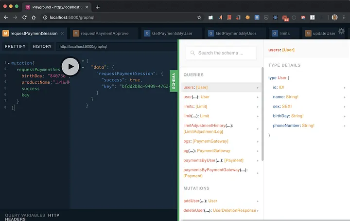

# Data

> MockUp : 실물과 비슷하게 화면을 구성해 보는 것

## [JSON](https://developer.mozilla.org/ko/docs/Learn/JavaScript/Objects/JSON)

JSON(Javascript Object Notation)은 Javascript 객체 문법으로 구조화된 데이터를 표현하기 위한 문자 기반의 표준 포맷이다.

Key와 Value로 이루어져 있다.

```json
[
  { category: "Fruits", price: "$1", stocked: true, name: "Apple" },
  { category: "Fruits", price: "$1", stocked: true, name: "Dragonfruit" },
  { category: "Fruits", price: "$2", stocked: false, name: "Passionfruit" },
  { category: "Vegetables", price: "$2", stocked: true, name: "Spinach" },
  { category: "Vegetables", price: "$4", stocked: false, name: "Pumpkin" },
  { category: "Vegetables", price: "$1", stocked: true, name: "Peas" }
]
```

## REST API(Representational State Transfer API)

- Resource 중심

### REST 구성

- 자원(Resource) : URI
- 행위(Verb) : HTTP Method(GET, POST, PUT/PATCH, DELETE)
- 표현(Representations)

### REST 특징

- Uniform (유니폼 인터페이스) : Uniform Interface는 URI로 지정한 리소스에 대한 조작을 통일되고 한정적인 인터페이스로 수행하는 아키텍처 스타일을 말합니다.

- Stateless (무상태성) : REST는 무상태성 성격을 갖습니다. 다시 말해 작업을 위한 상태정보를 따로 저장하고 관리하지 않습니다. 세션 정보나 쿠키정보를 별도로 저장하고 관리하지 않기 때문에 API 서버는 들어오는 요청만을 단순히 처리하면 됩니다. 때문에 서비스의 자유도가 높아지고 서버에서 불필요한 정보를 관리하지 않음으로써 구현이 단순해집니다.

- Cacheable (캐시 가능) : REST의 가장 큰 특징 중 하나는 HTTP라는 기존 웹표준을 그대로 사용하기 때문에, 웹에서 사용하는 기존 인프라를 그대로 활용이 가능합니다. 따라서 HTTP가 가진 캐싱 기능이 적용 가능합니다. HTTP 프로토콜 표준에서 사용하는 Last-Modified태그나 E-Tag를 이용하면 캐싱 구현이 가능합니다.

- Self-descriptiveness (자체 표현 구조) : REST의 또 다른 큰 특징 중 하나는 REST API 메시지만 보고도 이를 쉽게 이해 할 수 있는 자체 표현 구조로 되어 있다는 것입니다.

- Client - Server 구조 : REST 서버는 API 제공, 클라이언트는 사용자 인증이나 컨텍스트(세션, 로그인 정보)등을 직접 관리하는 구조로 각각의 역할이 확실히 구분되기 때문에 클라이언트와 서버에서 개발해야 할 내용이 명확해지고 서로간 의존성이 줄어들게 됩니다.

- 계층형 구조 : REST 서버는 다중 계층으로 구성될 수 있으며 보안, 로드 밸런싱, 암호화 계층을 추가해 구조상의 유연성을 둘 수 있고 PROXY, 게이트웨이 같은 네트워크 기반의 중간매체를 사용할 수 있게 합니다.

### REST API 디자인 가이드

- URI는 정보의 자원을 표현해야 한다.
- 자원에 대한 행위는 HTTP Method(GET, POST, PUT, DELETE)로 표현한다.

### REST API 중심 규칙

- URI는 정보의 자원을 표현해야 한다. (리소스명은 동사보다는 명사를 사용)

  ```text
  GET : /members/delete/1
  ```

- 자원에 대한 행위는 HTTP Method(GET, POST, PUT, DELETE등)로 표현

#### HTTP METHOD

- POST : 리소스 생성
- GET : 리소스 조회
- PUT : 리소스 수정
- DELETE : 리소스 삭제

### URI 설계시 주의할 점

- 슬래시 구분자(/)는 계층 관계를 나타내는 데 사용

 ```text
  http://restapi.example.com/houses/apartments
 ```

- URI 마지막 문자로 슬래시(/)를 포함하지 않는다.

 ```text
  http://restapi.example.com/houses/apartments
 ```

- 하이픈(-)은 URI 가독성을 높이는데 사용
- 밑줄(_)은 URI에 사용하지 않는다.
- URI 경로에는 소문자가 적합하다.
- 파일 확장자는 URI에 포함시키지 않는다. Acceept header를 사용

### 리소스 간의 관계 표현

리소스 간에 연관 관계가 있을 때에는 다음과 같은 표현 방법을 사용함.

관계명이 복잡할 때에는 서브 리소스에 명시적으로 표현하는 방법이 있음.

```text
GET : /users/{userid}/devices (일반적으로 소유 ‘has’의 관계를 표현할 때)
GET : /users/{userid}/likes/devices (관계명이 애매하거나 구체적 표현이 필요할 때)
```

### Collection과 Document

Document : 문서, 객체
Collection : 문서들의 집합, 객체들의 집합(복수로 사용함.)

```text
http:// restapi.example.com/sports/soccer
http:// restapi.example.com/sports/soccer/playeres/13
```

### HTTP 응답 상태 코드

| 상태 코드||
|------|---|
|200|클라이언트의 요청을 정상적으로 수행함|
|201|클라이언트가 어떠한 리소스 생성을 요청, 해당 리소스가 성공적으로 생성됨(POST를 통한 리소스 생성 작업 시)|

| 상태 코드||
|------|---|
|400|클라이언트의 요청이 부적절 할 경우 사용하는 응답 코드|
|401|클라이언트가 인증되지 않은 상태에서 보호된 리소스를 요청했을 때 사용하는 응답 코드(로그인 하지 않은 유저가 로그인 했을 때, 요청 가능한 리소스를 요청했을 때)|
|403|유저 인증상태와 관계 없이 응답하고 싶지 않은 리소스를 클라이언트가 요청했을 때 사용하는 응답 코드(403 보다는 400이나 404를 사용할 것을 권고. 403 자체가 리소스가 존재한다는 뜻이기 때문에)|
|405| 클라이언트가 요청한 리소스에서는 사용 불가능한 Method를 이용했을 경우 사용하는 응답 코드|

| 상태 코드||
|------|---|
|301|클라이언트가 요청한 리소스에 대한 URI가 변경 되었을 때 사용하는 응답 코드 (응답 시 Location header에 변경된 URI를 적어 줘야 합니다.)|
|500|서버에 문제가 있을 경우 사용하는 응답 코드|

---

## GraphQL(gql)

> 리액트에서 만든 쿼리 언더

- Graph 자료 구조

- sql은 데이터베이스 시스템에 저장된 데이터를 효율적으로 가져오는 것이 목적이고, gql은 웹 클라이언트가 데이터를 서버로 부터 효율적으로 가져오는 것이 목적입니다.

- Query에서 얻고자 하는 것을 지정

- Query(Read), Mutation(Command : Create, Update, Delete), Subscription(Event)

```graphql
{
  hero {
    name
    friends {
      name
    }
  }
}
```

특정 데이터베이스나 플랫폼에 종속적이지 않으며, 네트워크 방식에도 종속적이지 않습니다.

**일반적으로 gql의 인터페이스 송수신은 네트워크 레이어 L7의 HTTP POST 메서드와 웹소켓 프로토콜을 활용합니다.** 필요에 따라서는 얼마든지 L4의 TCP/UDP를 활용하거나 심지어 L2 형식의 이더넷 프레임을 활용 할 수도 있습니다.

### 쿼리/뮤테이션(query/mutation)

쿼리 : 데이터를 읽는데 사용(R)

뮤데이션 : 데이터를 변조하는데 사용(CUD)

#### 쿼리

```graphql
// 일반쿼리

{
  human(id: "1000") {
    name
    height
  }
}

// 오퍼레이션 네임 쿼리

query HeroNameAndFriends($episode: Episode) {
  hero(episode: $episode) {
    name
    friends {
      name
    }
  }
}
```

일반 쿼리와 오퍼레이션 네임 쿼리의 다른 점은 변수를 매개변수로 받을 수 있느냐 차이입니다.

```graphql
query getStudentInfomation($studentId: ID){
  personalInfo(studentId: $studentId) {
    // 개인정보들
  }
  classInfo(year: 2018, studentId: $studentId) {
    // 수업정보들
  }
  SATInfo(schoolCode: 0412, studentId: $studentId) {
    // SAT에 대한 정보들
  }
}
```

REST API로 위 3가지 정보를 불러오려 했다면, 서버로 3번의 요청을 보내야 했을 것 입니다..
하지만, GraphQL에서는 한번의 요청으로 3가지 정보들을 불러 올 수 있습니다.

### 스키마 / 타입(Scheme/Type)

#### 오브젝트 타입과 필드

```graphql
type Character {
 name : String!
 appearsIn : [Episode!]!
}
```

- 오브젝트 타입 : Character
- 필드 : name, appearsIn
- 스칼라 타입 : String, ID, Int 등
- 느낌표(!) : 필수 값을 의미(non-nullable)
- 대괄호([, ]) : 배열을 의미(array)

### 리졸버(resolver)

gql에서 데이터를 가져오는 구체적인 과정은 리졸버(resolver)가 담당하고, 이를 직접 구현해야 합니다.

리졸버를 직접 구현해야 하는 부담은 있지만, 이를 통해 데이터 source의 종류에 상관 없이 구현이 가능합니다.

gql쿼리에서는 각각의 필듭마다 함수가 하나 존재한다고 생각하고, 이 함수는 타입을 반환합니다. 그리고 이 함수를 리졸버(resolver)라고 합니다.
만약 필드가 스칼라 값(문자열, 숫자, primitive타입)인 경우에는 실행이 종료됩니다.
하지만 필드 타입이 스칼라 타입이 아닌 직접 정의한 타입이라면 해당 타입의 리졸버를 호출되게 합니다.

연쇄적 리졸버 호출은 DFS(Depth First Search)로 구현되어있을 것으로 추측하고 있습니다.

```graphql
// 유저에 대한 필드
type User{
  name: String!
  phoneNumber: String!
}

// 유저 1명이 가질수 있는 제한
type Limit {
  id: ID!
  amout: Int
  user: User
}

// 유저 1명이 지불한 지불정보들
type Payment {
  limit: Limit!
}
```

```graphql
{
  paymentsByUser(userId: 10) {
    id
    amount
  }
}
{
  paymentsByUser(userId: 10) {
    id
    amount
    user {
      name
      phoneNumber
    }
  }
}
```

위 코드는 쿼리문 호출시, paymentsByUser가 더 많은 리졸버를 호출하고 있다.

```graphql
{
 paymentsByUser(userId: 10) { // 리졸버 명세
  id
  amount
 }
}

Query: {
 paymentsByUser: async (parent, { userId }, context, info) => { // 리졸버 구현
   const limit = await Limit.findOne({ where: { UserId: userId } })
   const payments = await Payment.findAll({ where: { LimitId: limit.id } })
   return payments
 },
}
```

- 첫번째 인자는 부모 리졸버가 최종적으로 리턴한 값이 들어온다.
- 두번째 인자는 쿼리문에 넘겼던 매개변수(userId)가 들어온다.
- 세번째 인자는 모든 리졸버가 공통으로 사용하는 context가 들어오는데, 보통 미들웨어를 거쳐서 입력된 로그인과 같은 정보들이 들어온다.
- 네번째 인자는 스키마 정보나 필드 정보등이 들어있다.(잘 사용되지 않음.)

### 인트로스펙션(Introspection)

GraphQL의 인트로스펙션 기능을 사용하면 현재 서버에 저장된 스키마의 정보를 실시간으로 확인할수있다.

백엔드개발자가 스키마를 정의해주면 프론트엔드개발자는 그걸 실시간으로 확인해서 개발하면 된다.

GraphQL을 서버에서 사용하기 위해서는 apollo server라는 라이브러리를 사용하는데 여기서 기본적으로 제공하는 웹 IDE에서 현재 실시간 스키마 정보를 확인할 수 있다.



---

## REST API vs GraphQL

REST API는 URL, METHOD등을 조합함에 따라 다양한 Endpoint가 존재합니다.

하지만, GraphQL은 단 하나의 Endpoint만 존재합니다.


