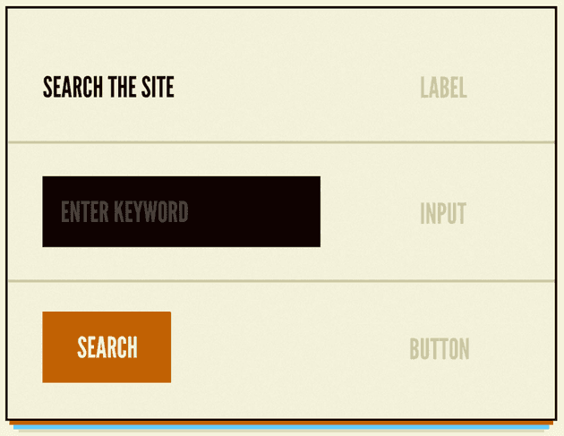
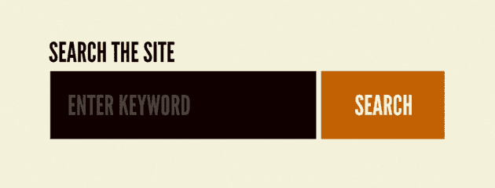
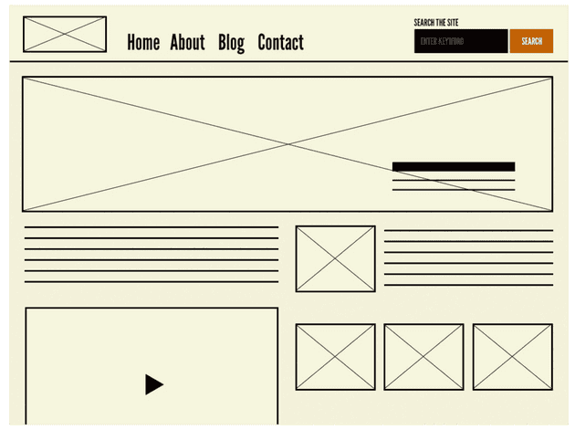
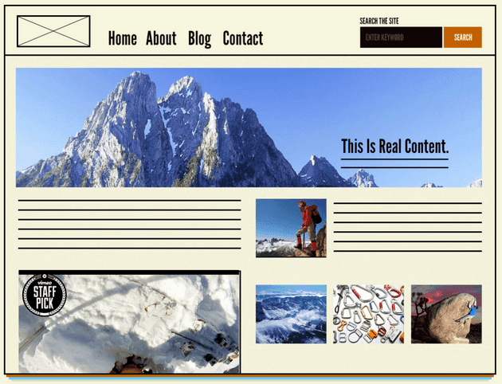

# Atomic Design

계층형 구조를 몇가지 카테고리로 묶은 방법

brad frost에 따르면 디자인 시스템은 어떤 조직이 디지털 인터페이스를 디자인하고 구축하는 방식에 대한 이야기라고 말합니다. 디자인 시스템은 여러가지 하위 시스템을 포함하는데, UI 컴포넌트와 variants, 타이포그래피 시스템, 컬러 팔레트 시스템, 레이아웃 / 그리드 시스템 등이 있습니다. 아토믹 디자인은 디자인 시스템을 만드는 방법론입니다. brad frost의 디자인 시스템 이야기에 관심이 있으시다면 [design systems are for user interface](https://bradfrost.com/blog/post/design-systems-are-for-user-interfaces/) 글을 추천드립니다.

이대로 만들어야 하는 것이 아닌, 개념적인 부분.

## Atom

> 더 이상 분해할 수 없는 기본 컴포넌트

HTML Element, 글꼴, 애니메이션, 컬러 팔레트, 레이아웃과 같이 추상적인 요소도 포함될 수 있습니다.

## Molecule

Atom을 결합하여 자신의 고유한 특성을 가집니다.

Molecule의 SRP는 재사용성과 UI에서의 일관성, 테스트 하기 쉬운 조건이라는 이점을 가집니다.

## Organism

서비스에서 표현될 수 있는 명확한 영역과 특정 컨텍스트를 가집니다.

Molecule에 비해 좀 더 구체적으로 표현되고, 컨텍스트를 가지게 됨에 따라 상대적으로 재사용성이 낮아지는 특성을 가집니다.

## Template

실제 컴포넌트를 레이아웃에 배치하고 구조를 잡는 와이어 프레임입니다.

> 와이어 프레임 : 웹사이트의 골격이나 애플리케이션의 사용자 인터페이스(UI) 및 핵심 기능을 나타내는 단순한 선과 도형으로 구성된 다이어그램 또는 다이어그램의 집합

## Page

유저가 볼 수 있는 실제 콘텐츠

Template의 실제 Instance라고 볼 수 있습니다.

---

Atomic Design은 선형(linear)프로세스가 아닙니다. 오히려 UI를 응집력 있는 전체와 일부분에 대한 콜렉션으로 생각할 수 있도록 도와주는 멘탈 모델입니다
