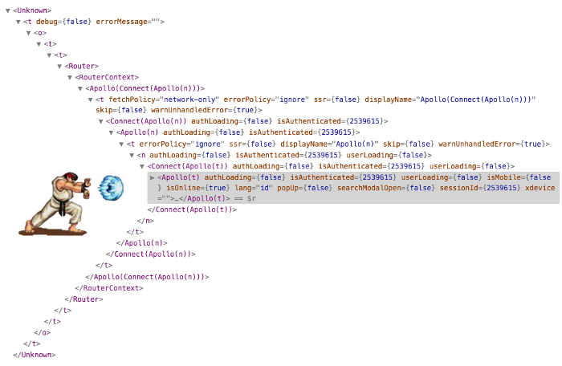

# React Hook

```
키워드

- React Hook 이란
- Hooks
    - useState
    - useEffect
    - useContext
    - useRef
    - useLayoutEffect
- React StrictMode 란
```

> [Hook의 개요](https://ko.reactjs.org/docs/hooks-intro.html)

> [Hook 개요](https://ko.reactjs.org/docs/hooks-overview.html)

> [Hooks API Reference](https://ko.reactjs.org/docs/hooks-reference.html)

React 16.8에서 Hooks가 도입됨. 기존 방식에 있던 몇 가지 문제를 해결.

[React Conf 2018 Hooks 소개 영상](https://youtu.be/dpw9EHDh2bM)

기존 방식의 문제점:

- ### Wrapper Hell (HoC)

- Huge Components
- Confusing Classes

## [HoC (Higher-Order Components)](https://ko.reactjs.org/docs/higher-order-components.html)

고차 컴포넌트라고 부르며, 컴포넌트 로직을 재사용하기 위한 React의 고급 기술이다.

---

React를 쓰는 방식을 완전히 바꾼 커다란 변화.
→ 이제는 예전으로 돌아가는 게 불가능하다!

---

### 기존

- 상태를 가진 컴포넌트는 Class Component로 만들고, props만 사용하는 재사용이 용이한 작은 컴포넌트는 Function Component로 작성.

- Redux에서도 비슷한 구분이 존재했다.
  - [Presentational and Container Components - Dan Abramov](https://medium.com/@dan_abramov/smart-and-dumb-components-7ca2f9a7c7d0)

---

### 현재

- 그냥 Function Component만 사용.
- 상태 관리 유무를 바로 알기 어려움 = 신경쓰지 않아도 됨.
- 복잡한 요소는 전부 Hook으로 격리 및 재사용 가능.

---

### 대표적인 Hooks

#### 기본 Hook

- useState → State Hook ⇒ React의 State
- useEffect ⇒ Side-effect
- useContext

---

#### 부가 Hook

- useRef
- useLayoutEffect → useEffect와 조금 다름.

  ...


---

useEffet의 경우, 외부(external sytem)과 동기화(Synchronize)하지 않는 이상 쓰지 마라


> useEffect 완벽 가이드 꼭 읽어 볼 것!

11:04