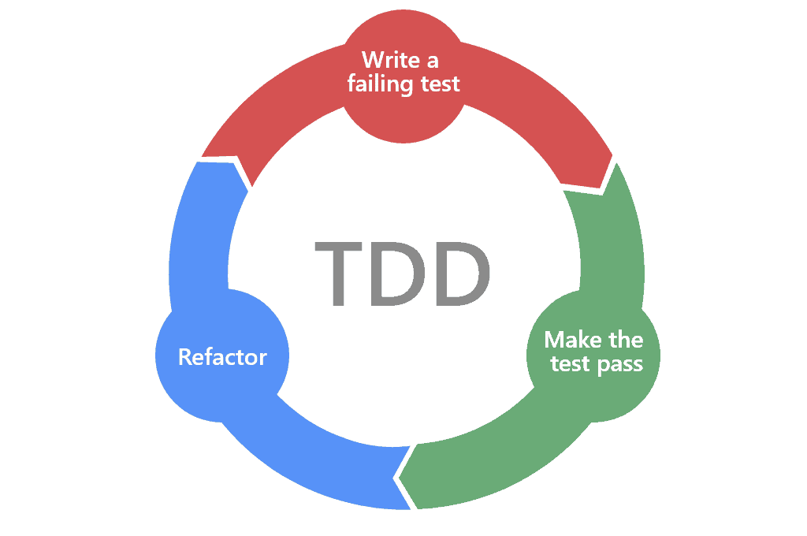

# TDD

```
키워드

TDD란
Jest
Describe-Context-It 패턴
단위테스트란
```

> TDD 에 대해서 주의할 점
테스트 코드를 작성한다고 해서 TDD 가 아닙니다.

>TDD Cycle 에 따라 테스트 코드를 먼저 작성하고, 구현하고, 리팩터링 하는 과정을 엄격하게 지켜서 개발을 진행해야 TDD 라고 할 수 있다.

## TDD(Test Driven Development)
>
> [테스트 주도 개발](https://github.com/ahastudio/til/blob/main/agile/test-driven-development.md)
>

> [TDD FAQ](https://github.com/ahastudio/til/blob/main/blog/2016/12-03-tdd-faq.md)
>

> [Jest를 이용한 간단한 TDD 예제](https://github.com/ahastudio/til/blob/main/jest/20201204-simple-tdd-example.md)
>



### TDD Cycle

1. Red → 실패하는 테스트 코드를 작성. 인터페이스와 스펙에 집중한다.

2. Green → 재빨리 테스트를 통과시킨다. 올바른 방법이 아니어도 괜찮다.

3. Refactor → 리팩터링을 통해 코드를 올바르게 만든다. TDD에서 가장 중요한 부분이지만, 간과될 때가 많다.

---

일단은 작동해야 한다. 그 이후에 리팩터링을 하는 것

> 작은 단계를 찾고, 코드에서 피드백을 얻는 게 (어렵고) 중요하다.

> 2번이 어렵다면 1번으로 돌아가서 더 작고 쉬운 문제를 정의하고, 3번을 위해 의도를 드러내고 중복을 찾아 제거하는 연습을 해야 한다.

> 이 둘이 익숙하지 않으면 TDD를 하는 게 거의 불가능하고, 사실 이 둘이 어려우면 일반적인 개발 또는 클린 코드를 작성하는 것 또한 매우 힘들다.

### Jest

Facebook에서 만든 테스트 도구

> [Jest](https://jestjs.io/)
>

> [Given-When-Then](https://github.com/ahastudio/til/blob/main/blog/2018/12-08-given-when-then.md)
>

테스트 케이스를 정의할 때 크게 두 가지 방법을 사용한다:

1. test 함수로 개별 테스트를 나열하는 방식.
2. BDD 스타일로 주체-행위 중심으로
테스트를 조직화하는 방식.

---

```bash
App.test.ts

App.spec.ts
```

테스트를 위한 파일명은 test | spec으로 작성한다.

```typescript
test('add', () => {
 expect(add(1,2)).toBe(3)
})
```

Jest에서 TypeScript를 사용하도록 jest.config.js 작성

```js
module.exports = {
 testEnvironment: 'jsdom',
 setupFilesAfterEnv: [
  '@testing-library/jest-dom/extend-expect',
 ],
 transform: {
  '^.+\\.(t|j)sx?$': ['@swc/jest', {
   jsc: {
    parser: {
     syntax: 'typescript', 
     jsx: true,
     decorators: true,
    },
    transform: { 
     react: {
      runtime: 'automatic',
     },
    },
   },
  }],
 },
};
```

자동으로 계속 jest가 감지할 수 있도록 하려면 다음과 같이 한다.

```bash
npx jest --watchAll
```

### BDD(Behavior Driven Development)

Given-When-Then 스타일

#### Give When Then

> 준비 - 실행 - 검증

> 700W 전자렌지를 준비해서 3분만 돌리면 완성!

```bash
# Given
# 필요한 것
stove = Stove.new(700.watts)

# When
# 수행 동작
food = stove.cook(3.minute)

# Then
# 예상 결과
assert food.complete?
```

---

> context는 지원하지 않으므로, 다음과 같이 사용한다.

```typescript
const context = describe;

decribe('add', () => {
 context('with two arguments', () => {
  it('returns sum of two numbers', () => {
   expect(add(1,2)).toBe(3)
  })
 })
})
```
