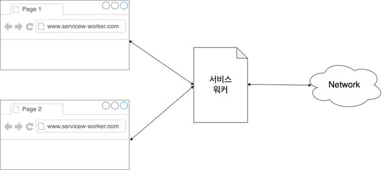
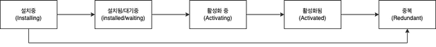

# MSW(Mock Service Worker)

```text
키워드

- Service worker
- MSW(Mock Service Worker)
- polyfill(폴리필)
```

> [MSW](https://mswjs.io/)

> [Service Worker API](https://developer.mozilla.org/ko/docs/Web/API/Service_Worker_API)

> [아샬의 Mock Service Worker (MSW)](https://github.com/ahastudio/til/blob/main/mock-api/msw.md)

> [Mocking REST API](https://mswjs.io/docs/getting-started/mocks/rest-api)

> [Integrate mocking into Node](https://mswjs.io/docs/getting-started/integrate/node)

> 코드 레벨이 아니라 네트워크 레벨에서 가짜를 구현하는 것.
> 오프라인 작업 등을 지원하기 위한 서비스 워커의 기능을 유용히 활용한 것

## Service Worker

> [서비스 워커에 대해 알아보고 Mock Response 만들기](https://fe-developers.kakaoent.com/2022/221208-service-worker/)

특정 출저(사이트)의 하나 혹은 그 이상의 페이지를 제어하는 스크립트

이벤트 기반 워커로서, JavaScript로 작성된 파일

자신이 제어하는 페이지에서 발생하는 이벤트를 수신할 구 있다. 네트워크 요청과 같은 이벤트를 가로채어 수정할 수 있고, 이를 다시 페이지로 돌려보낼 수 있다.

### 서비스 워커의 위치



서비스 워커는 브라우저 또는 탭의 외부에 위치함에 따라, 네트워크 요청을 가로채거나 리소스를 캐싱할 수 있다.

서비스워커는 독립적으로 동작되어, 브라우저가 닫혀도 네트워크와 통신할 수 있다.

이를통해, 푸시알림을 수신하면 브라우저에 전달하거나, 백그라운드에서 앱의 데이터를 최신화 할 수 있다.

### 서비스 워커의 라이프 사이클



---

## MSW 패키지 설치

```bash
npm i -D msw@1.3.2 -D
```

> 최신버전(2.x)으로 받을시, 강의 영상과 다르게 설정을 해야 하고, 아직 안정적이지 않은 것 같다.

강의와 동일하게 환경설정이 되지 않아, 다른 방법을 찾아서 환경설정을 진행하였다.

[MWS 환경설정](https://jinist.tistory.com/368)

`jest.config.js` 파일의 “setupFilesAfterEnv” 속성에 `setupTests.ts` 파일 추가.

```javascript
module.exports = {
 testEnvironment: 'jsdom',
 setupFilesAfterEnv: [
  '@testing-library/jest-dom/extend-expect',
  '<rootDir>/src/setupTests.ts',
 ],
 transform: {
  '^.+\\.(t|j)sx?$': ['@swc/jest', {
   jsc: {
    parser: {
     syntax: 'typescript',
     jsx: true,
     decorators: true,
    },
    transform: {
     react: {
      runtime: 'automatic',
     },
    },
   },
  }],
 },
};
```

`src/setupTests.ts` 파일

```typescript
import 'whatwg-fetch'
// fetch is not defined를 해결하기 위한 의존성 도구
```

`src/mocks/server.ts` 파일

```typescript
import { setupServer } from 'msw/node';
import { handlers } from './handlers';

export const server = setupServer(...handlers);
```

`src/mocks/browser.ts` 파일

```typescript
import { setupWorker } from 'msw';
import { handlers } from './handlers';

export const worker = setupWorker(...handlers);
```

`src/mocks/handlers.ts` 파일

```typescript
import { rest } from 'msw';

const BASE_URL = 'http://localhost:3000';

export const handlers = [
 rest.get(`${BASE_URL}/products`, (req, res, ctx) => {
  const products = [
   {
    category: 'Fruits', price: '$1', stocked: true, name: 'Apple',
   },
  ];

  return res(
   ctx.json({ products }),
  );
 }),
];
export default handlers;
```

```typescript
import { render, screen, waitFor } from '@testing-library/react';

import App from './App';

// jest.mock 불필요.

test('App', async () => {
 render(<App />);

await waitFor(() => {
  screen.getByText('Apple');
 });
});
```

waitFor를 통해, 응답을 기다란다.

---

```typescript

// useFectProduct를 통해 jest를 실행시, error가 발생된다.
// fetch is not defined

export default function useFetchProducts() {
 const url = 'http://localhost:3000/products';
 const { data, error } = useFetch<ProductResult>(url);
 console.log(error)
 if (!data) {
  return []
 }
 return data.products;
}

```

> 강의 기준의 node에서는, node에서 fetch를 사용시, `fetch is not defined`가 발생된다.
> 이를 개선하기 위해, fetch polyfill을 설치한다.

[Github Fetch PolyFill](https://github.com/JakeChampion/fetch)

```typescript
// 호스트를 상수로 선언하여 관리한다.

const BASE_URL = process.env.API_BASE_RUL || 'http://localhost:3000'
```

> 너무 본격적으로 코딩하면 사실상 백엔드를 개발하게 되니, 이 부분에 주의할 것.

테스트 환경(Node.js 기반) 외에 웹 브라우저도 지원하기 때문에, API 스펙은 나왔지만 아직 구현되지 않은 경우 임시로 사용할 수도 있다. 단순히 임시 서버를 만들 거라면 Express를 쓰는 게 더 낫지만, 테스트 코드도 지원하면서 겸사겸사 웹 브라우저를 지원하는 용도로는 나쁘지 않은 선택이다.

> Mock에만 의존하면 안된다. 실제 API도 테스트를 해야 한다.

---

## Polyfill

> 기본적으로 지원하지 않는 이전 브라우저에서 최신 기능을 제공하는 데 필요한 코드 (JavaScript) ”mdn”

polyfill을 지원하는 대표적인 라이브러리는 core-js와 polyfill.io가 있다.
