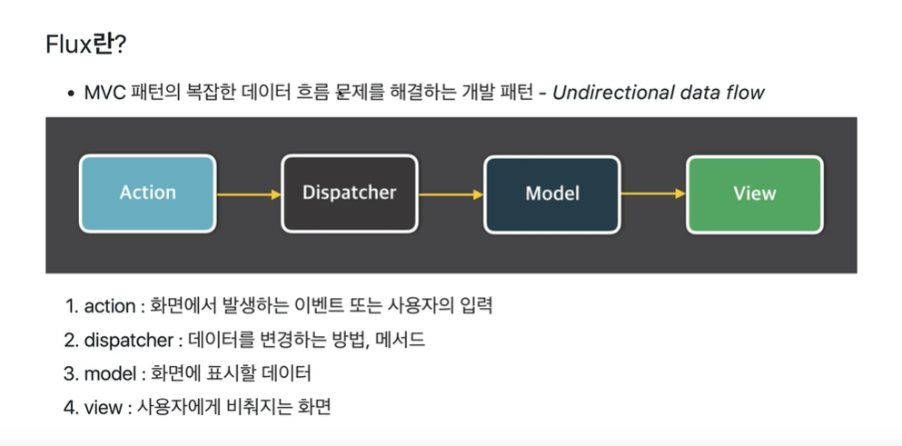

# External Store

```text
키워드

- 관심사의 분리
- Layered Architecture
- Flux Architecture
- useReducer
- useCallback
```

리액트의 외부에서 상태를 관리하는 것

## 관심사의 분리(Separation of Concerns)

> [관심사의 분리](https://ko.wikipedia.org/wiki/관심사_분리)

하나의 시스템은 작은 부품이 모여서 만들어진다. 우리는 이미 작은 컴포넌트를 합쳐서 더 큰 컴포넌트를 만드는 방식으로 개발하고 있다.

어떤 기준을 사용할 수 있을까? 흔히 사용되는 Layered Architecture에선 사용자에게 가까운 것과 사용자에게서 먼 것으로 구분한다. 가장 가까운 건 UI를 다루는 부분, 그 다음엔 Business Logic을 다루는 부분, 그 너머에는 데이터에 접근하고 저장하는 부분으로 나눌 수 있게 된다. 각 부분은 하나의 역할, 하나의 관심사로 격리됨으로써 복잡도를 낮추게 된다.

거대한 프로그램이 아니라고 해도 흔히 Input → Process → Output이란 3단계로 코드를 적절히 구분만 해도 코드를 이해하고 유지보수하는데 크게 도움이 된다. 하나의 Output은 다시 사용자에게 Input을 요청하게 되고, 일반적인 프로그램은 다음과 같이 계속 순환하는 구조가 된다.

1. Input: 프로그램 시작
2. Process: 프로그램 초기화
3. Output: 사용자에게 초기 UI 보여주기
4. Input: 사용자의 입력
5. Process: 사용자의 입력에 따라 처리
6. Output: 처리 결과 보여주기
7. Input: 사용자의 또 다른 입력
8. …반복…

널리 알려진 MVC로 거칠게 매핑하면 다음과 같다.

- Model → Process
- View → Output
- Controller → Input

## Flux Architecture

> [Flux](https://facebook.github.io/flux/docs/in-depth-overview/)

> [Flux (한국어)](https://haruair.github.io/flux/docs/overview.html)

> [Redux의 핵심](https://ko.redux.js.org/tutorials/essentials/part-1-overview-concepts)

Facebook(현 Meta)에서 MVC의 대안으로 내세운 아키텍처.

2-way binding을 썼을 때 생길 수 있는 Model-View의 복잡한 관계(전통적인 MVC에선 이런 상황을 지양한다)를 겨냥해 명확히 “**unidirectional data flow**”를 강조한다.



1. Action → 이벤트/메시지 같은 객체.
2. Dispatcher → (여러) Store로 Action을 전달. 메시지 브로커와 유사하다.
3. Store (여러 개) → 받은 Action에 따라 상태를 변경. 상태 변경을 알림.
4. View → Store의 상태를 반영.

Redux는 단일 Store를 사용함으로써 좀 더 단순한 그림을 제안한다.

1. Action
2. Store → dispatch를 통해 Action을 받고, 사용자가 정의한 reducer를 통해 State를 변경한다.
3. View → State를 반영.

Action을 어떻게 표현하느냐가 사용성에 큰 차이를 만든다. 하지만 상태를 UI에 반영하는 방법은 모두 동일하다.

3단계 프로세스와 거칠게 매핑하면 다음과 같다.

- Input → Action + dispatch
- Process → reducer
- Output → View(React)

## External Store

> [forceUpdate와 같은 것이 있습니까?](https://ko.reactjs.org/docs/hooks-faq.html#is-there-something-like-forceupdate)

특별히 쓰이지 않는 상태라고 해도(React는 이걸 판단하기 어려움), “상태가 바뀌면” 해당 컴포넌트와 하위 컴포넌트를 다시 렌더링한다.

```typescript
const [ignored, forceUpdate] = useReducer((x) => x + 1, 0);
```

`setState는 내부적으로 useReducer를 사용함.`

거의 같은 거라고 보면 됨.

---

```tsx
const [state , setState] = useState({});
const forceUpdate = () => setState({});
```

```tsx
// Custom Hook으로 External State 구현
let count = 0;
function  useForceUpdate() {
  const [state, setState] = useState(0);

  const forceUpdate = () => {
    setState(state + 1);
  }

  return forceUpdate;
}

export default function Counter() {
  const forceUpdate= useForceUpdate();

  const handleClick = () => {
    count += 1;
    forceUpdate();
  }

  return (
    ...
  )
}
```

위와 같은 방식이 기본적인 External State의 아이디어이다.

중요한것은 `상태의 변경이다.`

위와 같은 접근을 잘 하면, React가 UI를 담당하고, 순수한 TypeScript(또는 JavaScript)가 비즈니스 로직을 담당하는, 관심사의 분리(Separation of Concerns)를 명확히 할 수 있다. 자주 바뀌는 UI 요소에 대한 테스트 대신, 오래 유지되는(바뀌면 치명적인) 비즈니스 로직에 대한 테스트 코드를 작성해 유지보수에 도움이 되는 테스트 코드를 치밀하게 작성할 수 있다.

---

## useCallback

useCallback을 사용하면, 함수가 매번 바뀌는 것이 아니라, 항상 같다.

`useEffect와 비슷함`
