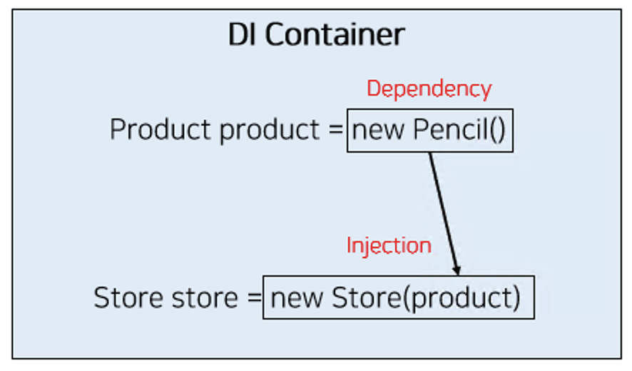

# TSyringe

```
키워드

- TSyringe
- 의존성 주입(Dependency Injection)
- reflect-metadata
- singleton (싱글톤)
```

Context를 사용하는 것은 전체를 바꾸기 떄문에 비효율적일 수 있다.

> Context를 사용하는 것은 전체를 Force Update하는 것에 가깝다.

## TSyringe

> [TSyringe](https://github.com/microsoft/tsyringe)

> [reflect-metadata](https://github.com/rbuckton/reflect-metadata)

> [The problem with passing props](https://beta.reactjs.org/learn/passing-data-deeply-with-context#the-problem-with-passing-props)

TypeScript용 DI 도구(IoC Container). External Store를 관리하는데 활용할 수 있다. React 컴포넌트 입장에서는 “전역”처럼 여겨진다. “Prop Drilling” 문제를 우아하게 해결할 수 있는 방법 중 하나(React로 한정하면 Context도 쓸 수 있다).

---

의존성 설치

```bash
npm i tsyringe reflect-metadata
```

`src/main.tsx` 파일과 `src/setupTests.ts` 파일에서 reflect-metadata import

```tsx
import "reflect-metadata";
```

싱글톤으로 관리할 CounterStore 클래스를 준비:

```tsx
import { singleton } from "tsyringe";

@singleton()
class CounterStore {
  // …(중략)...
}
```

싱글톤 CounterStore 객체를 사용:

```tsx
import { container } from "tsyringe";

const counterStore = container.resolve(CounterStore);
```

```json
    "jsx": "react-jsx", /* Specify what JSX code is generated. */
    "experimentalDecorators": true, /* Enable experimental support for TC39 stage 2 draft decorators. */
    "emitDecoratorMetadata": true, /* Emit design-type metadata for decorated declarations in source files. */

```

experimentalDecorators, emitDecoratorMetaData의 주석을 해제한다.

테스트에서 TSyringe에서 관리하는 객체를 초기화할 수 있다.

```tsx
container.clearInstances();
```

## DI(의존성 주입)



> 의존대상 B가 변하면, 그것이 A에 영향을 미친다.
> \- 토비의 스프링 3.1

### Dependency Injection

의존관계를 외부에서 결정하고 주입하는 것

클래스간 의존성을 클래스 외부에서 주입 하는 것

### DI 장점

1. 의존성이 줄어든다.
2. 재사용성이 높은 코드가 된다.
3. 테스트하기 좋은 코드가 된다.
4. 가독성이 높아진다.

## 상태 변경 알림

Store는 어떤 식으로든 action을 처리하고, 상태가 바뀌면 연결된 컴포넌트를 forceUpdate한다.

컴포넌트는 해당 Store에서 상태를 얻어서 UI를 업데이트하게 되는데, 선언형 UI가 얼마나 편한지 절실히 느낄 수 있다.

---

### Counter Store

```tsx
// Store
import { singleton } from "tsyringe";

type Listener = () => void;

@singleton()
export default class Store {
  count = 0;

  listeners = new Set<Listener>();

  publish() {
    this.listeners.forEach((listener) => {
      listener();
    });
  }

  addListener(listener: Listener) {
    this.listeners.add(listener);
  }

  removeListener(listener: Listener) {
    this.listeners.delete(listener);
  }
}
```

```tsx
// Count.tsx

import { container } from "tsyringe";

import Store from "../stores/Store";
import { useForceUpdate } from "../hooks/useForceUpdate";
import { useEffect } from "react";

export default function Counter() {
  const store = container.resolve(Store);

  const forceUpdate = useForceUpdate();

  useEffect(() => {
    store.addListener(forceUpdate);

    return () => {
      store.removeListener(forceUpdate);
    };
  }, [store, forceUpdate]);

  return (
    <div>
      <p>Count : {store.count}</p>
    </div>
  );
}
```

```tsx
// CountControl.tsx

import { useForceUpdate } from "../hooks/useForceUpdate";
import { container } from "tsyringe";

import Store from "../stores/Store";

export default function Counter() {
  const store = container.resolve(Store);

  const handleClickIncrese = () => {
    store.count += 1;
    store.publish();
  };

  const handleClickDecrease = () => {
    store.count -= 1;
    store.publish();
  };

  return (
    <div>
      <button type="button" onClick={handleClickIncrese}>
        {" "}
        Increase{" "}
      </button>
      <button type="button" onClick={handleClickDecrease}>
        {" "}
        Decrease{" "}
      </button>
    </div>
  );
}
```

## Reflect-metadata

### 메타 프로그래밍

프로그래밍의 대상이 되는 언어를 대상 언어, 프로그래밍 하는 언어를 메타 언어라고 한다.

이 중 스스로 메타 언어가 되는 것을 반영 혹은 리플렉션(Reflection)이라고 한다.

그리고 이러한 프로그래밍을 메타 프로그래밍이라고 부른다.

---

### 메타 프로그래밍의 세가지 구조

- 런타임 엔진 코드를 API를 통해 노출시키는 방식
- 문자열로 된 프로그램을 동적 실행하는 방식
- 해당 언어 범위를 벗어난 것

---

### Reflect

자바스크립트에는 리플렉션과 비슷한 이름의 리플렉트(Reflect) API가 있다.

```javascript
Reflect.defineProperty(foo, "name", { writable: true });
```

Obejct와 Reflect가 자바스크립으에 이미 정의된 속성을 다루는 API를 제공하지만 이것만으로 메타 프로그래밍을 하기에는 부족하다.
이를 극복하기 위해 `리플렉트 메타데이터` [Metadata Proposal - ECMAScript](https://rbuckton.github.io/reflect-metadata/)`가 제안되었다.

### 리플렉트 메타데이터(Reflect MetaData)

메타 데이터를 저장할 인터널 슬롯을 추가하고, 여기에 접근할 수 있는 ReflectAPI를 추가한다.

[Metadata] : 모든 객체의 메타데이터를 관리하기 위한 맵
[DefineMetadata] : Reflect.defineMetadata로 호출할 인터널 메소드. 객체 혹은 메소드의 메타데이터를 정의
[GetMetadata] : Reflect.getMetadata로 호출할 인터널 메소드. 객체 혹은 메소드의 메타데이터를 정의
