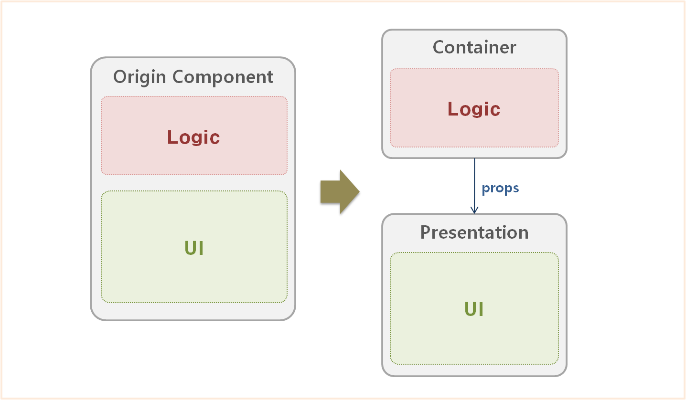
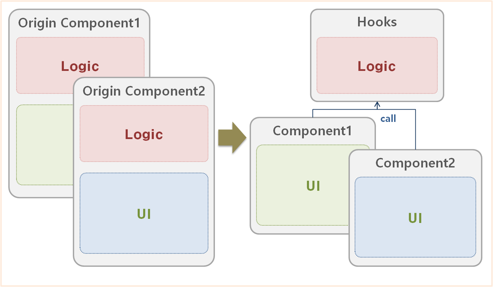

# 장바구니에 상품 담기

`Product`와 관련된 `Option` 정보, 수량 등 다양한 조합이 조합되어 `Cart Item`을 구성하는 것을 장바구니에 상품을 담는다는 의미가 된다.

> 프론트엔드와 백엔드가 같이 타입을 논의하면서, 진행하는 것이 좋다.

---

## AddToCartForm 컴포넌트

1. 옵션을 보여주고, 선택할 수 있다.
2. 수량을 정하게 한다.(기본값 : 1)
3. 수량에 맞는 비용을 보여준다.
4. 장바구니에 담기 버튼이 있고, 버튼 실행 시 장바구니에 담았다는 메세지가 나타난다.

Props Drilling을 피하기 위해 Store에서 가져와 사용하도록 했다.

```tsx
export default function AddToCartForm() {
  return (
    <div>
      <Options />
      <Quantity />
      <Price />
      <SubmitButton />
    </div>
  );
}
```

> Store를 잘 관리하는 것이 중요하다.

> 역할에 맞게 분리하여 구성하는 것이 좋다.

> 비즈니스 로직을 구분하므로써, 테스트도 더 간편해진다.

---

## Immutatble(불변성)

[Array를 Immutable하게 변경하기](https://github.com/ahastudio/til/blob/main/javascript/immutable-array.md)

불변성(Immutability)란 말그대로 변하지 않는 것을 의미한다. 불변 데이터는 한번 생성되고나면 그 뒤에는 변할수 없다.

불변 객체를 사용하는 것이 도움될 수 있다.

- 성능 향상하기(향후 객체의 변경에 대한 계획 없음)
- 메모리 사용을 줄이기(전체 객체를 복제하는 대신 객체 참조 만들기)
- 스레드 안전성(여러 스레드가 서로 간섭하지 않고 동일한 객체 참조 가능)
- 개발자의 정신적인 부담 감소(객체의 상태가 변경되지 않고 항상 일관됨)

### Push

```typescript
const a = [1, 2, 3];
const b = [...a, 4];
```

### Shift

``` typescript
const a = [1, 2, 3];
const [b, ...c] = a;
```


### Pop

```typescript
const a = [1, 2, 3];
const b = a[a.length - 1];
const c = a.slice(0, a.length - 1);
```

### Remove (by value)

```typescript
const a = [1, 2, 3];
const b = a.filter(i => i !== 2);
```

### Remove (by index)

```typescript
const a = [1, 2, 3];
const b = a.filter((_, i) => i !== 1);

const a = [1, 2, 3];
const b = [...a.slice(0, 1), ...a.slice(1 + 1)];
```

---

## 비즈니스 로직

비즈니스 로직(Business logic)은 컴퓨터 프로그램에서 실세계의 규칙에 따라 데이터를 생성·표시·저장·변경하는 부분을 일컫는다.

이 용어는 특히 데이터베이스, 표시장치 등 프로그램의 다른 부분과 대조되는 개념으로 쓰인다.

---

## 테스트

유닛테스트로는 개별적인 요소가 잘 완성되었는지 확인이 가능하며, E2E테스트를 통해 맡겨진 업무가 잘 끝낫는지 확인하면 된다.

---

## 리액트 디자인 패턴

### Presetation & Container

#### Container 컴포넌트

- API 호출, State 관리, 이벤트 처리등의 작업을 수행하는 컴포넌트

- 변경된 상태 값을 props를 통해 Presentaion 컴포넌트로 전달함.

#### Presentation 컴포넌트

- UI를 표시하는 컴포넌트
- 직접 상태값을 관리하지 않고 Container 컴포넌트가 전달해준 props를 받아 출력



#### 특징

- 컴포넌트간 의존도가 낮고, Presentaion 컴포넌트를 재사용 할 수 있음.
- 컴포넌트별 역할이 명확하여, 코드 구조를 이해하기 쉬움
- state를 여러 컴포넌트에 props로 전달하여 상태를 공유할 수 있음.

#### 예시코드

```tsx
// Presentation Component
function SearchFormView() {

    const {searchKey, onChange, onSubmit} = props;

    return (
        <form onSubmit={onSubmit}>
            <div>
                <label>제목</label>
                <input type="text" value={searchKey} onChange={onChange} name="searchKey"/>
                <button type="submit">검색</button>
            </div>
        </form>
    )
}
export default SearchFormView;
```

```tsx
// Container Component
function SearchFormContainer() {

    const [searchKey, setSearcKey] = useState();

    function onChange(event) {
        setSearcKey(event.target.value);
    }

    function onSubmit(event) {
        event.preventDefault();
        console.log(searchKey);
    }

    return (
        <SearchFormView
            searchKey={searchKey}
            onChange={onChange}
            onSubmit={onSubmit}
        />
    )
}

export default SearchFormContainer;
```

---

### Custom Hooks

로직을 Hooks로 분리하여 관리하는 디자인 패턴

로직을 Hook로 분리함으로서 로직 재사용이 가능해짐.



#### 예시코드

```tsx
function SearchForm() {

    const { searchKey, onChange, onSubmit } = useSearch();

    return (
        <form onSubmit={onSubmit}>
            <div>
                <label>제목</label>
                <input type="text" value={searchKey} onChange={onChange} name="searchKey"/>
                <button type="submit">검색</button>
            </div>
        </form>
    )
}

export default SearchForm;
```

```tsx
// Hooks
export default function useSearch() {

    const [searchKey, setSearcKey] = useState();

    function onChange(event) {
        setSearcKey(event.target.value);
    }

    function onSubmit(event) {
        event.preventDefault();
        console.log(searchKey);
    }

    return {
        searchKey,
        onChange,
        onSubmit,
    }
}
```

#### 특징

- 여러 컴포넌트에서 동일한 로직을 공유할 수 있습니다.
- 컴포넌트의 제어가 쉬워지고 사용자가 더 많은 통제권을 가질 수 있음
- 로직이 렌더링과 분리되어 있어, 이를 연결하기 위해서는 컴포넌트의 동작방식에 대한 깊은 이해가 필요함.

---

### [Atomic Design Pattern](../3/page-3.md)

#### 특징

- 장점
  - 컴포넌트 재사용성이 극대화 될 수 있음
  - 컴포넌트 계층 구조를 알아보기 쉬워 설계 변경이 필요할 때 빠르게 대처할 수 있음.
  - 디자인 요소가 재사용될 컴포넌트에 일괄로 적용되므로 stylee 적용 및 변경이 쉬움.

- 단점
  - 컴포넌트가 적절히 분리되지 않으면, 컴포넌트의 복잡도가 높아져 유지보수가 까다로움.
  - Page부터 Atom까지 너무 많은 Props Drilling이 일어나 개발 피로도가 증가됨.
