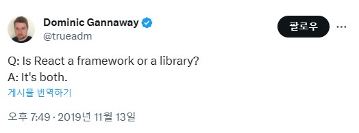

# React

```text
키워드

- React란?
  - React 컴포넌트
  - React 리렌더링
  - IoC(Inversion of Control)
  - Library vs Framework
```

React 공식문서(https://ko.legacy.reactjs.org/)
React Dev문서(https://react.dev/)

- React로 작업하는 프로세스는 [Thinking in React](https://beta.reactjs.org/learn/thinking-in-react)를 참고. “상태”를 골라내는 게 핵심이다.

필독
> https://overreacted.io/ko/react-as-a-ui-runtime/

## 렌더링

> 숫자 선언시, 1_000와 같이 '_'로 자릿수를 표시할 수 있다. : Separators for numeric literals 

필요한 부분만 업데이트를 함.

[Updating-a-root-component](https://react.dev/reference/react-dom/client/createRoot#updating-a-root-component)

변경된 부분만 업데이트하기 때문에 하단 입력 컨트롤에 입력한 값이 그대로 유지된다. 

## 리렌더링
- [React는 컴포넌트를 언제 다시 리렌더링 할까요?](https://velog.io/@surim014/react-rerender)
- [왜 리액트에서 리렌더링이 발생하는가](https://medium.com/@yujso66/%EB%B2%88%EC%97%AD-%EC%99%9C-%EB%A6%AC%EC%95%A1%ED%8A%B8%EC%97%90%EC%84%9C-%EB%A6%AC%EB%A0%8C%EB%8D%94%EB%A7%81%EC%9D%B4-%EB%B0%9C%EC%83%9D%ED%95%98%EB%8A%94%EA%B0%80-74dd239b0063)
- [React렌더링 동작에 대한 (거의) 완벽한 가이드](https://velog.io/@superlipbalm/blogged-answers-a-mostly-complete-guide-to-react-rendering-behavior)

React는 State가 변경되었을 때 리렌더링이 발생된다.
내가 리렌더링을 하면 자식 컴포넌트도 리렌더링이 발생할 수 있다.

## 리액트는 라이브러리인가 프레임워크인가?


## 제어의 역전
[제어의 역전](https://martinfowler.com/bliki/InversionOfControl.html)(IoC: Inversion of Control)이 Framework의 주요한 특징이고, React는 IoC를 통해 상태와 업데이트가 얽힌 복잡한 상황을 간단히 선언형 UI로 구성하는 혜택을 누린다(이게 바로 React의 첫 번째 특징이다). 그 누구도 매번 root를 render하는 방식으로 쓰면서 “이게 라이브러리지!”라며 감탄하지 않는다.

하지만 일반적으로는 (Martin Fowler의 개탄처럼) IoC는 IoC 컨테이너와 엮여서 DI와 동의어처럼 쓰이고, Next.js, Remix 같은 걸 Framework이라고 부르니 면접 때 괜히 이런 걸로 싸우지는 말자. “리액트 개발자가 이렇게 이야기했다니까요!”라고 해봐야 서로 감정만 상할 뿐이다.
